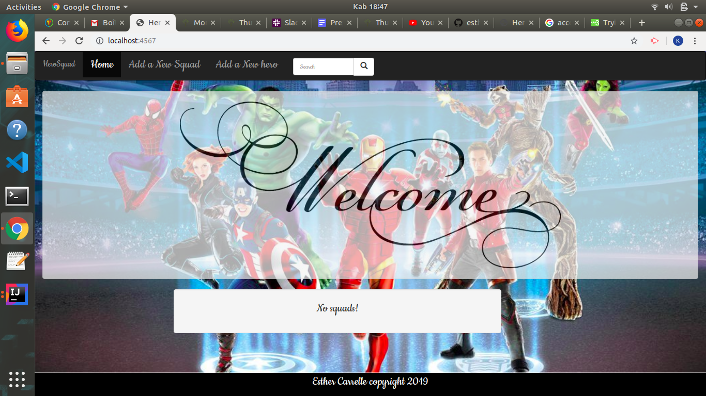

# Hero Squad
#### Hero Squad, September 13rd 2019
#### By **esther Carrelle**



## Author's name


```bash
Esther Carrelle
```

## Description

```bash
Its an app that allows one to recruit a well-balanced team of superheroes,
where at the very least, they should have a name, age, special power and weakness.
The heroes should also have a max size, name, and a cause
a hero can only participate in one Squad at a time.
```

## User Requirements
```bash
The applications allow users to do the following:
1.Add a new squad
2.Add a new hero 
3.Add a squad name , size and a cause
4.View a list of current squads
3.View a list of heros 

```

## Contact Details
```bash
You can contact me at esthcarelle@gmail.com
```

## License

- This project is licensed under the MIT Open Source license Copyright (c) 2019. [Esther Carrelle](https://)
